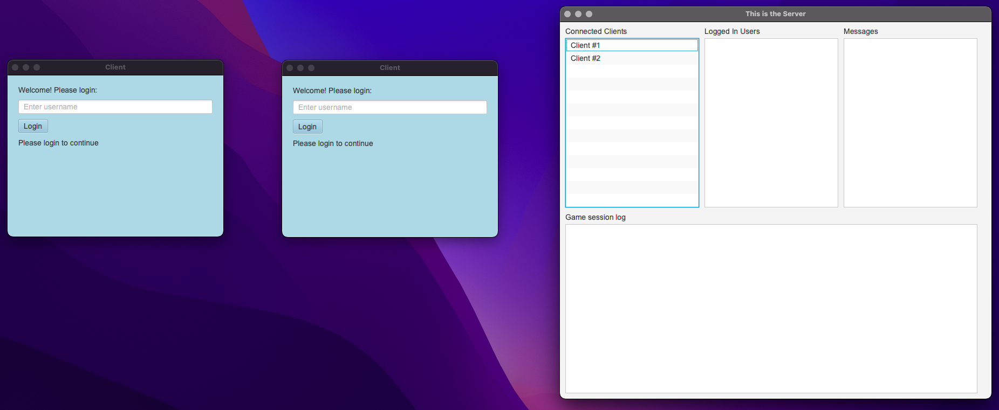
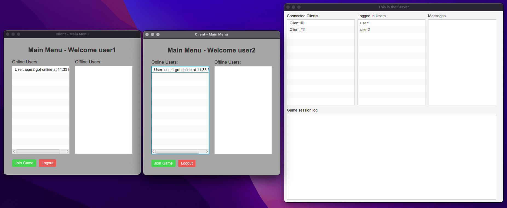
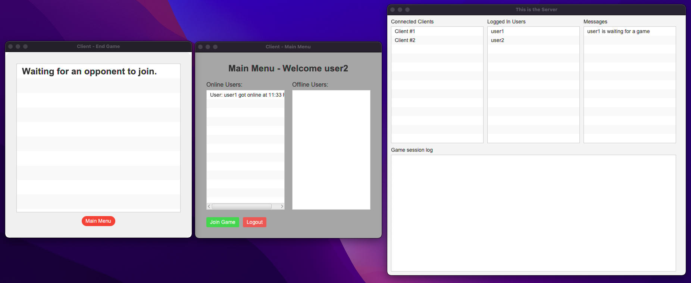
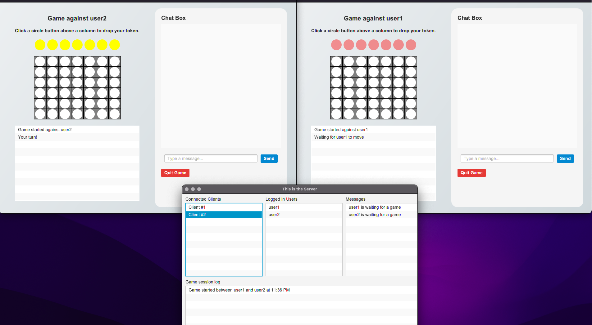
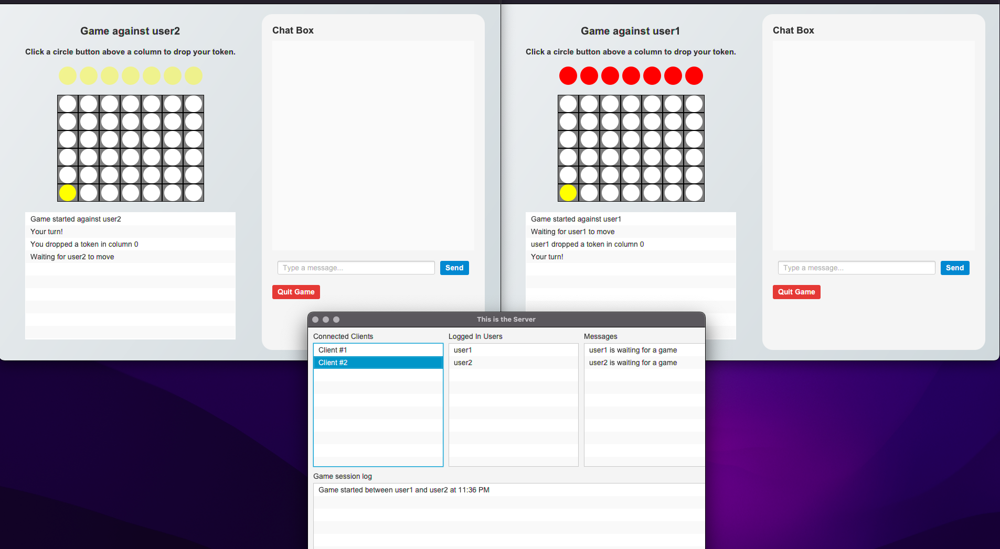
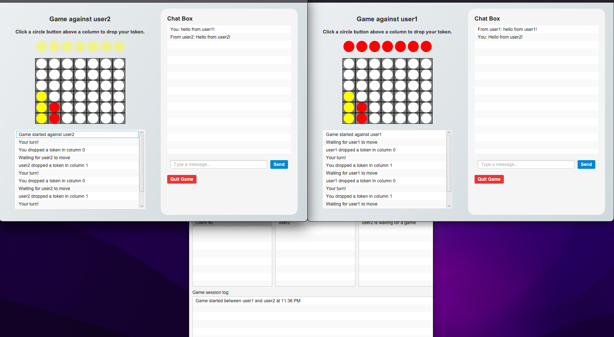
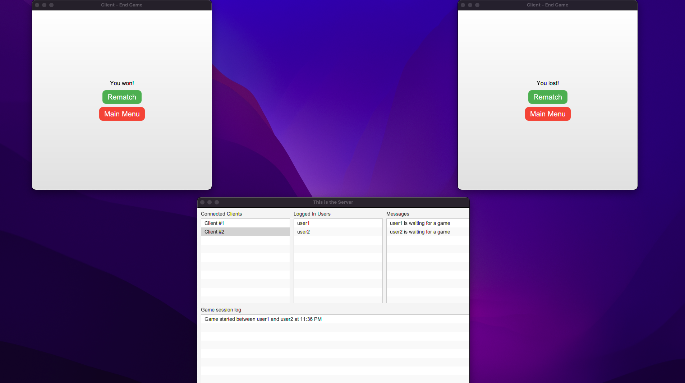
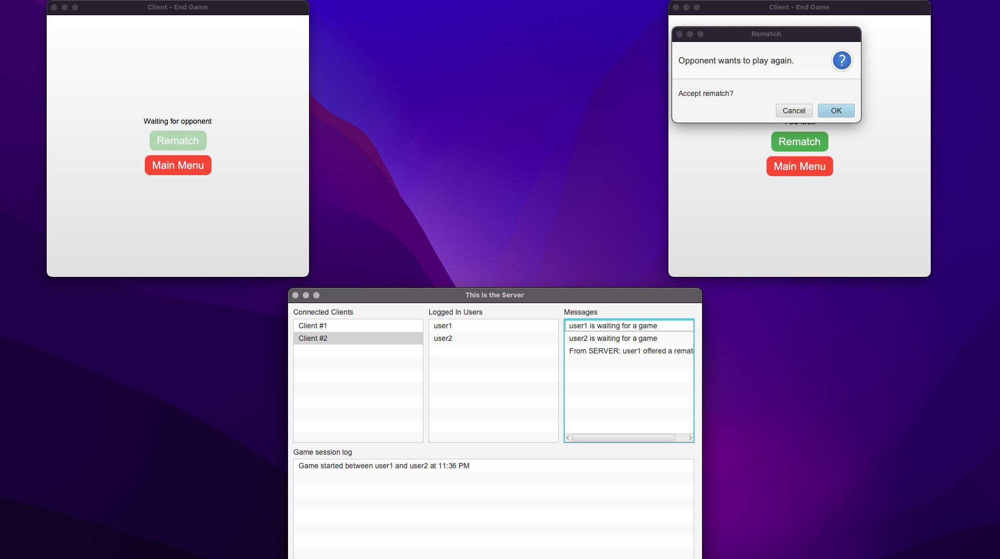
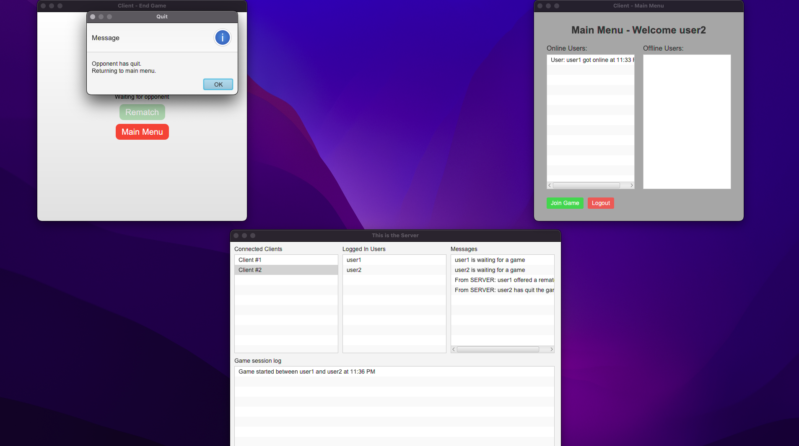
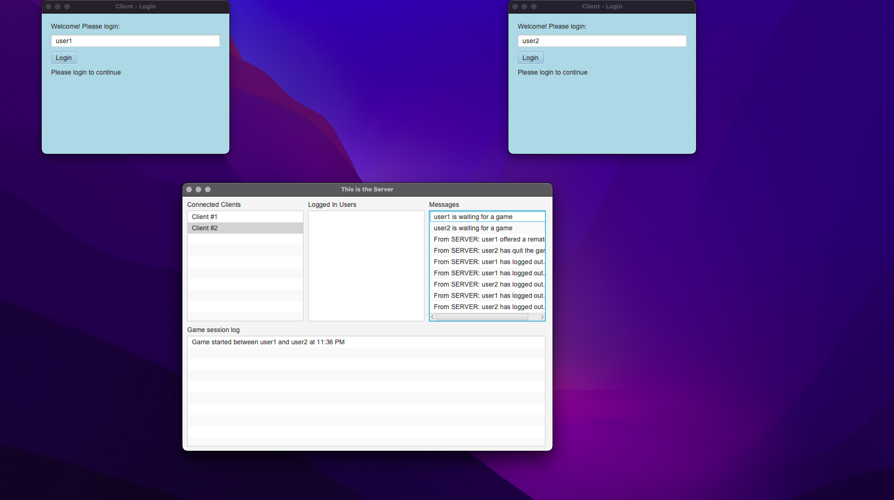

# Connect 4 - Client-Server Game

A two-player Connect 4 game built in Java using a client-server architecture with a graphical user interface. Multiple clients can connect to the server and compete against opponents in separate game sessions.

## Gameplay Preview

1. Two clients connect to the server



2. Both users log in



3. One player joins a game and is placed in the waiting queue



4. Once both players have joined, the game begins



5. A player makes a move — both clients' boards update in real time



6. Players can chat using the built-in chat box



7. The game ends with a win/lose notification. Tie games are also supported.



8. A rematch prompt is shown



9. A player declines the rematch



10. Both players log out




## Project Structure

```bash
├── Project3Client
│   ├── pom.xml
│   └── src
│       └── main
│           └── java
│               ├── Client.java
│               ├── GameState.java
│               ├── GuiClient.java
│               ├── Message.java
│               └── MessageType.java
├── Project3Server
│   ├── pom.xml
│   └── src
│       └── main
│           └── java
│               ├── GuiServer.java
│               ├── Message.java
│               ├── MessageType.java
│               └── Server.java
```
## What We Learned
- Designing a multi-threaded server to handle concurrent connections
- Implementing client-server communication using sockets
- Building a JavaFX GUI to render an interactive game board

## How to Run

### Requirments
- Java 17+
- Maven

### Running the server
```bash
cd Project3Server
mvn compile exec:java
```

### Running the Client
```bash
cd Project3Client
mvn compile exec:java
```

## Contributors
- Adam A.
- John L.

## Acknowledgments
This project was developed as part of the coursework for CS 342: Software Design at the University of Illinois Chicago (UIC), Spring 2025.
